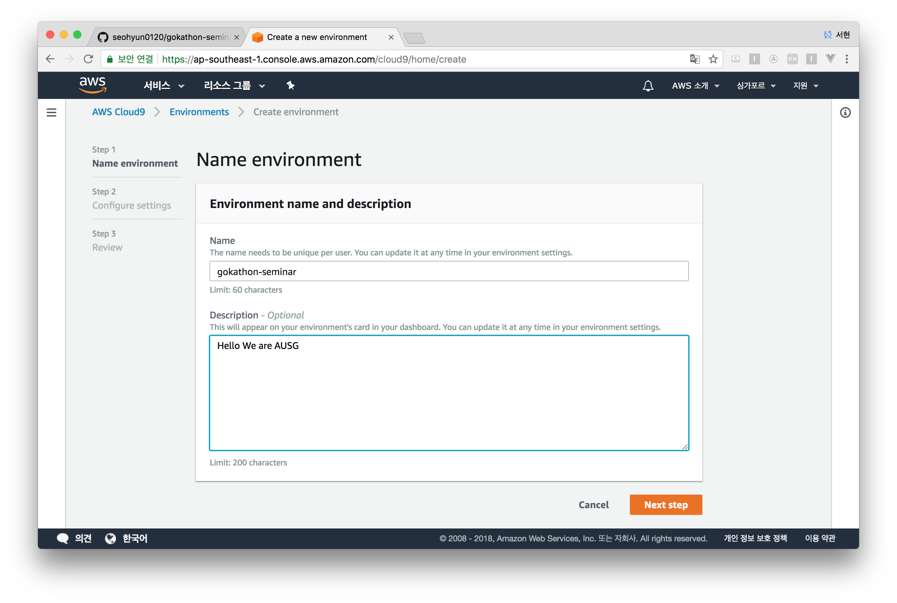
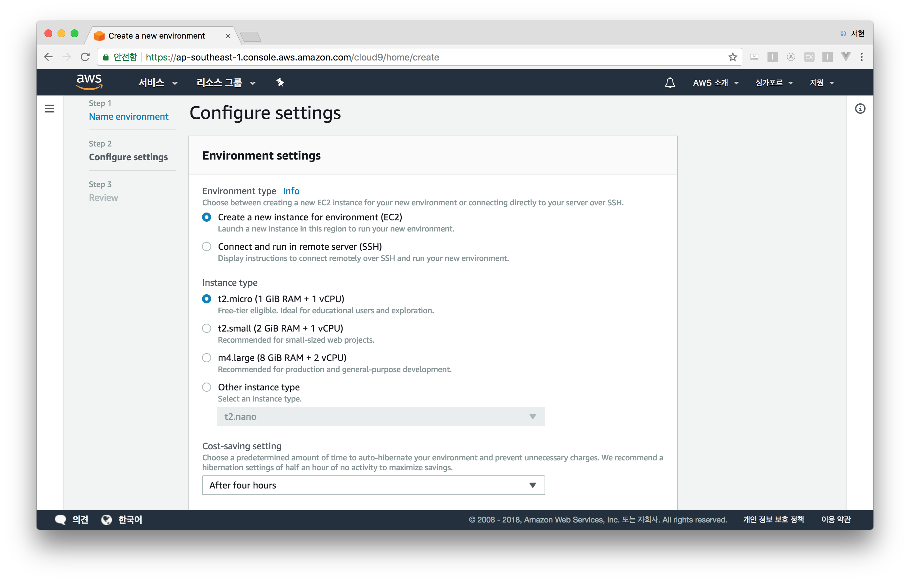
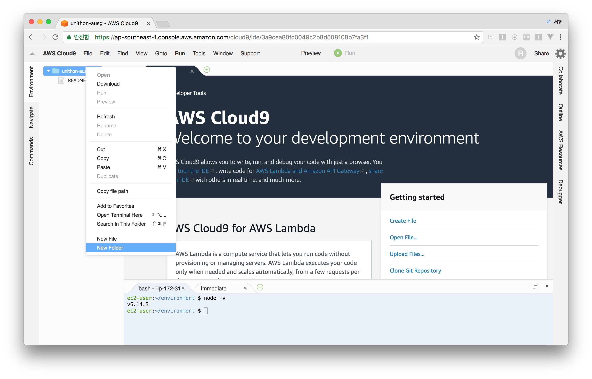
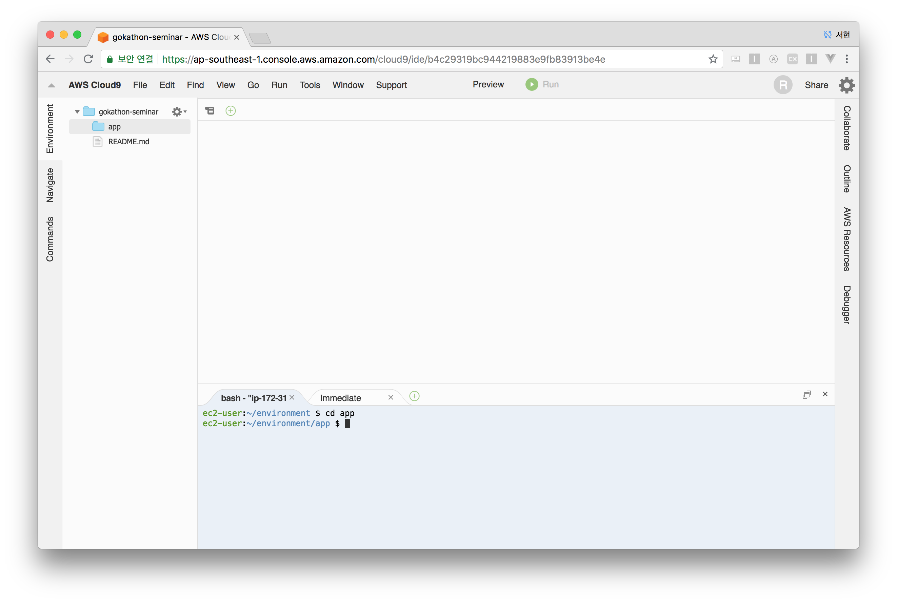
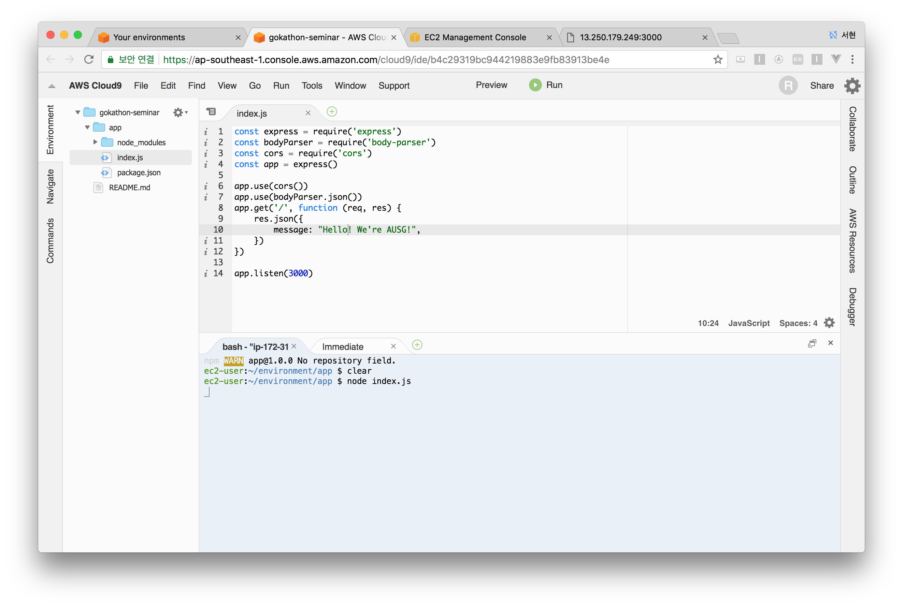
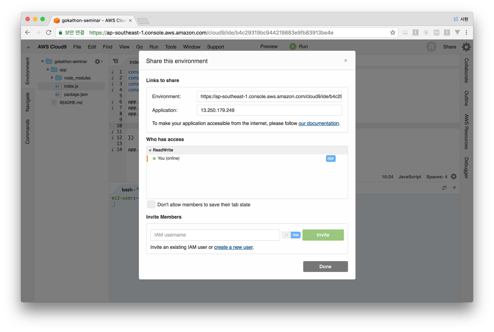
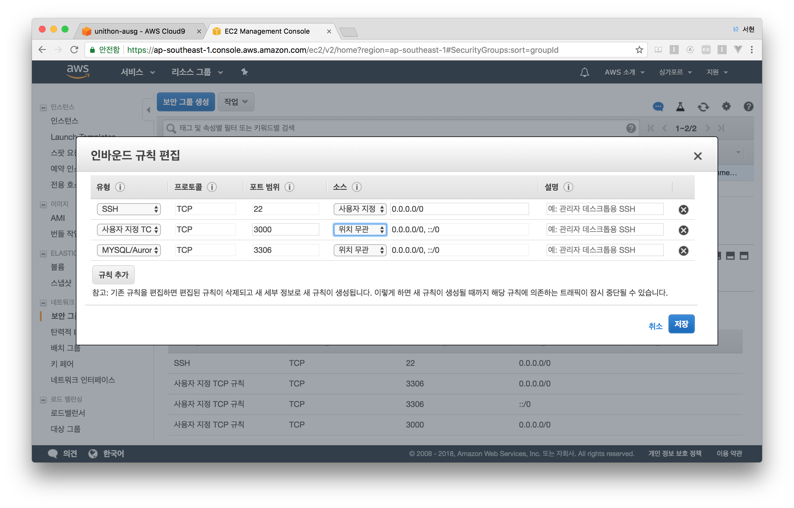
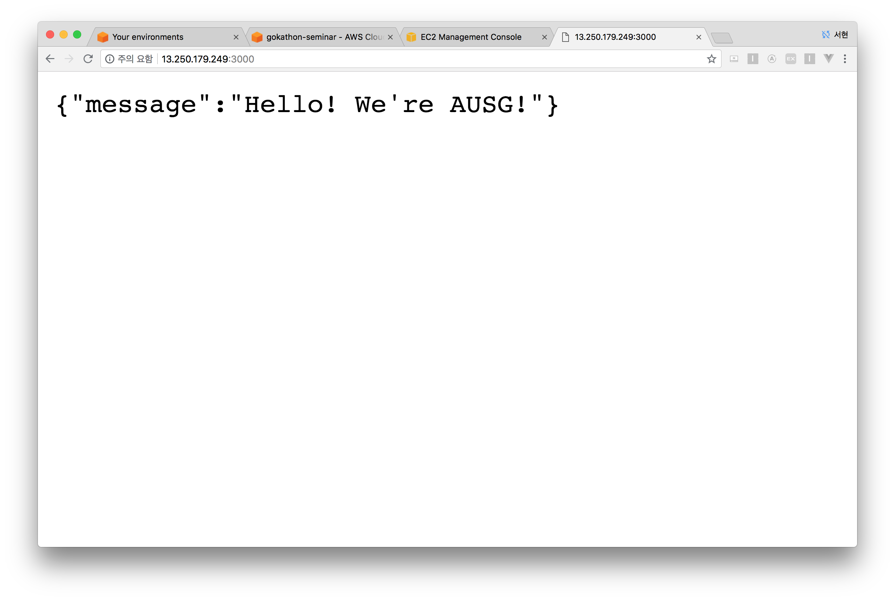

## AWS Cloud9

AWS Cloud9은 웹 브라우저상으로 코드 작성 및 실행, 디버깅을 할 수 있는 클라우드기반의 통합 개발 환경입니다. [서비스소개](https://aws.amazon.com/ko/cloud9/?nc2=h_m1)

협업할때 사용하기 좋은 툴입니다. 


## AWS Cloud9 생성하기

- 싱가폴 리전을 선택해주세요. 서울 리전은 아직 출시되지 않았습니다. 
- AWS Cloud9 서비스로 이동해주세요.
- Create Environment 버튼을 클릭합니다.



- 세부 환경을 적어주세요.


- 다음과 같이 환경을 설정해주세요.



- Next Step > 설정된 값 다시 한 번 확인 > Create Enviroment

> 이제 EC2가 자동으로 생성됩니다.


## 기본적인 Node.js 앱 만들기

Cloud9에는 기본적으로 Node.js가 설치되어있기에 따로 설치하실 필요는 없습니다.

> 2018.7.18 기준 v.6.14.3


- 왼쪽 위 파일 브라우저에서 오른쪽 클릭을 통해 새로운 폴더를 만들어주세요. (**New Folder** 클릭)

  

- 새로운 폴더 이름은 **app**으로 해주세요. (임의로 설정해주셔도 좋습니다.)

- 터미널에서 **cd 명령어**를 통해 **app 폴더**로 이동합니다.

```bash
$ cd app
```




- 폴더로 알맞게 이동했는지 확인해주세요. 터미널 창 왼쪽에 (ec2-user:~/environment/app $) 라고 뜬다면 성공!
- npm init 명령어를 이용해 새로운 프로젝트를 만들어주세요. 

```bash
$ npm init
```


- 몇 가지 설정들을 물어보는데 기본값으로 설정해주세요. (enter 계속 입력) 
- 앞으로 사용될 라이브러리들을 미리 설치해주세요. 

```bash
$ npm install express body-parser cors --save
```


- 설치가 완료되었다면 왼쪽 브라우저 탭에서 오른쪽 클릭을 통해 **New File**을 선택하고, 이름은 **index.js**로 설정해주세요.
- **index.js**에 샘플 코드를 작성해주세요.

```
const express = require('express')
const bodyParser = require('body-parser')
const cors = require('cors')
const app = express()

app.use(cors())
app.use(bodyParser.json())
app.get('/', function (req, res) {
    res.json({
        message: "Hello, Unithon! We're AUSG!",
    })
})

app.listen(3000)
```


- 터미널에서 해당 앱을 실행합니다. 

```
$ node index.js
```


- 오른쪽 위 **Share** 버튼을 클릭해주세요. 

  

  

- Links to Share의 IP주소를 확인합니다.

  

## 인스턴스 보안 설정

- EC2로 이동해주세요.

- 네트워크 및 보안 --> 보안그룹 으로 이동합니다.

  


- 해당하는 **보안그룹**을 선택하고 하단의 **인바운드 탭**을 클릭해주세요.

- **편집** 버튼을 누르고 아래와 같이 포트를 추가해준 후 **저장** 버튼을 누릅니다. 

  > 인바운드 규칙 편집을 통해 포트를 추가적으로 열 수 있습니다. 이번 실습에서는 3000번 포트와, 곧 추가할 MySQL 3306번 포트를 추가합니다.

  


## 결과확인

- **Share**에서 확인한 IP주소 뒤에 **:3000**을 붙여 확인해봅시다.

- 아래와 같이 출력된다면 성공 :tada:

  

축하드립니다. 다음 세션으로 넘어가주세요.