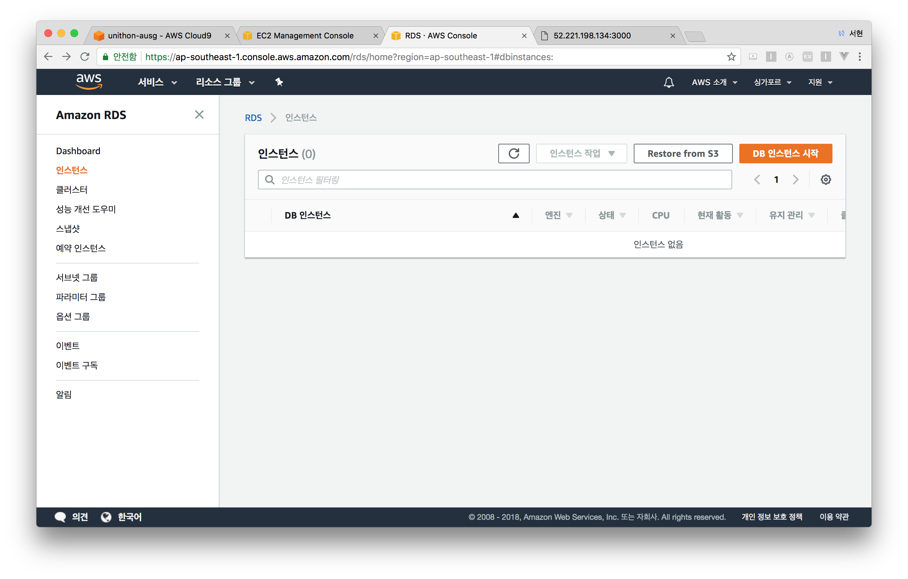
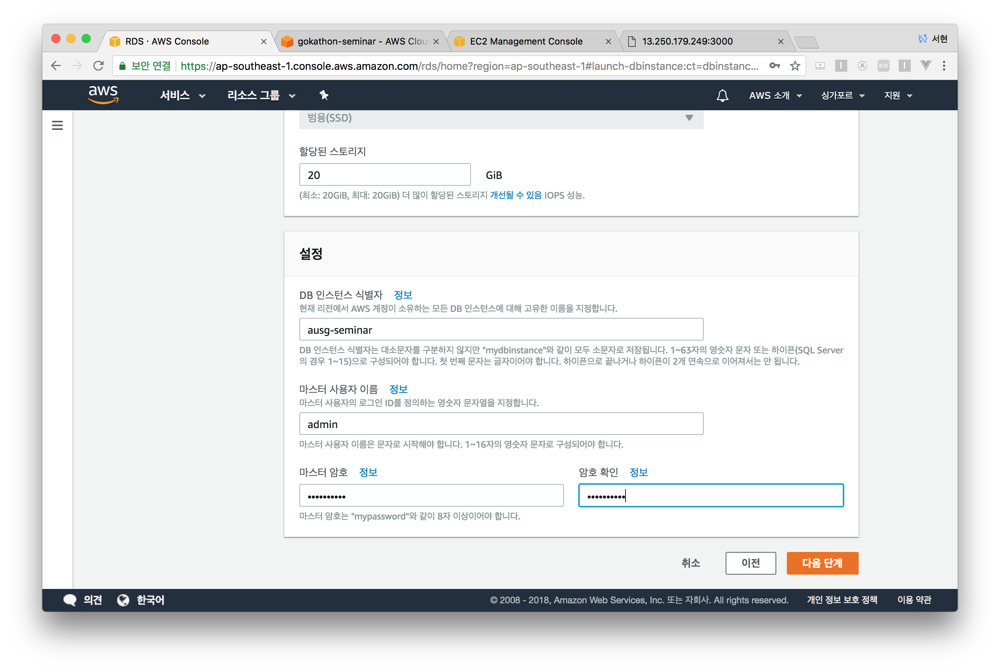
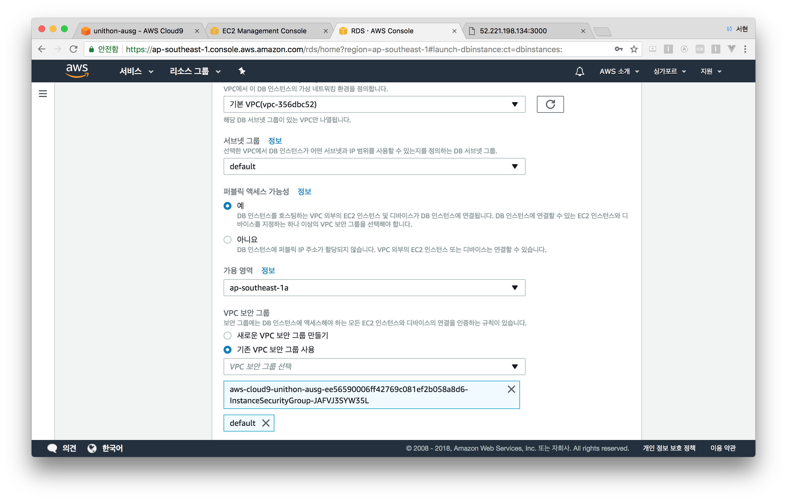

# AWS RDS

## RDS 생성하기

- RDS 서비스로 이동합니다. (싱가폴리전)
- 좌측 **인스턴스탭**을 선택해주세요.
- **`DB 인스턴스 시작`**을 클릭합니다.

- **개발/테스트 - MySQL**을 선택 후, 다음 단계를 클릭해주세요.

- 프리티어 타이틀의 **`RDS 프리 티어에 적용되는 옵션만 사용`**에 체크합니다.

  

- 밑으로 내려 다음과 같이 설정해주세요.
  - DB인스턴스 식별자: DB 인스턴스 이름을 입력합니다.
  - 마스터 사용자 이름: DB의 루트 계정으로 사용할 ID를 입력합니다.
  - 마스터 암호: DB의 루트 계정의 암호를 입력합니다.
  - 위 사항을 꼭 기억해두시고, **`다음 단계`**를 클릭해주세요.

- `네트워크 및 보안`  →  `가용 영역` →  `ap-southeast-1a` 를 선택해주세요.
- `네트워크 및 보안`  →  `기존 VPC 보안 그룹 사용`  →  **Cloud9과 같은 이름**을 가진 보안그룹을 선택해주세요.

- `데이터베이스 옵션   `  →  데이터베이스 이름에 `hellodb`를 입력합니다.

- 나머지 사항은 그대로 둔 채, **DB 인스턴스 시작**을 클릭합니다.  

## MySQL 엔드포인트 확인

- 좌측 탭의 **인스턴스**를 눌러주세요.
- 해당 DB인스턴스 이름을 클릭하고, 하단의 **연결**파트에 **엔드포인트**를 확인하세요.

축하드립니다. 다음 세션으로 이동해주세요. 